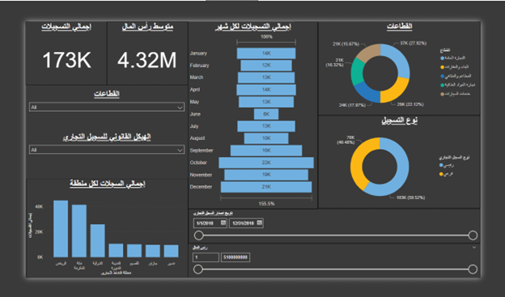

# Power BI Dashboard

This repository contains a Power BI dashboard for data visualization and analytics.

## Dashboard Preview

### 📊 Dashboard Screenshot


### 🎥 Dashboard Video Demo
[](dashboard.mp4)

## How to View the Dashboard
1. Download the `dashboard.pbix` file.
2. Open it using **Power BI Desktop**.

## Repository Structure
```
PowerBI-Dashboard/
│-- README.md  # Project description
│-- dashboard.pbix  # Power BI file
│-- dashboard.png  # Screenshot of the dashboard
│-- dashboard.mp4  # Video demo
```

## License
This project is licensed under the MIT License.
